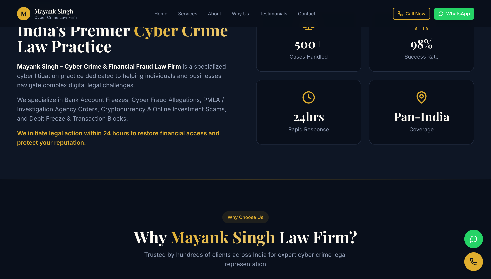

#  Mayank Singh – Cyber Crime Law Firm Website

A modern, responsive, high-conversion static website built for a cyber crime advocate specializing in bank account freezes, cyber fraud, PMLA cases, and fund recovery across India.

This project focuses on **trust-building UI, fast performance, SEO readiness, and mobile responsiveness** using the latest frontend stack.

---

##  Live Preview
> [https://cyberlawyerindia.in/]


---

## Project Preview

| Hero Section | Services & Trust Section |
|-------------|--------------------------|
|  |  |

---

##  Tech Stack

| Technology | Usage |
|----------|------|
| **Vite** | Fast bundler & dev server |
| **React (TypeScript)** | Component-based UI |
| **TypeScript** | Type safety |
| **Tailwind CSS** | Utility-first styling |
| **shadcn/ui** | Accessible UI components |
| **Lucide Icons** | Icons |
| **Responsive Design** | Mobile-first layout |

---

##  Features

- High-conversion legal landing page design  
- Mobile & tablet responsive   
- Fast loading (Vite optimized)  
- WhatsApp & Call CTA integration  
- Modern glassmorphism UI  
- Trust badges & statistics section  
- Professional legal brand styling  

---

## 📂 Folder Structure

```txt
├── public/
│   └── preview-1.png
│   └── preview-2.png
├── src/
│   ├── components/
│   ├── pages/
│   ├── lib/
│   ├── App.tsx
│   └── main.tsx
├── index.html
├── tailwind.config.ts
├── vite.config.ts
└── package.json
